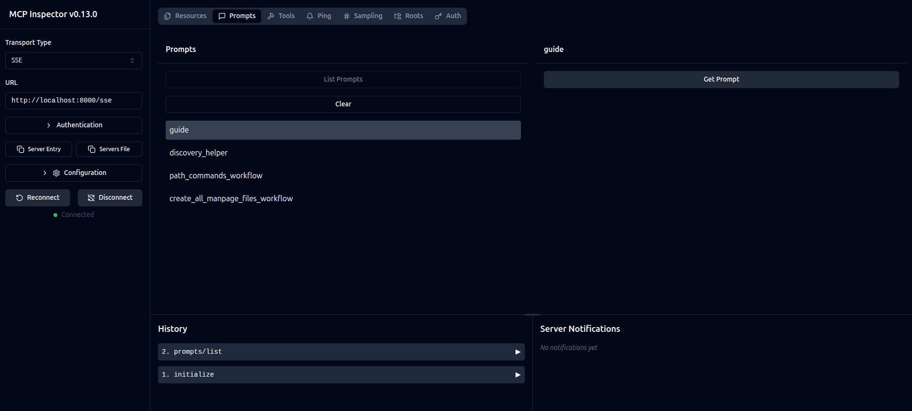
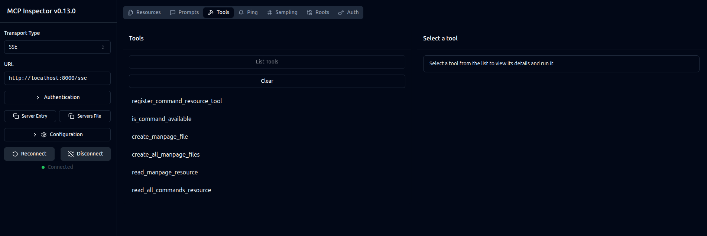
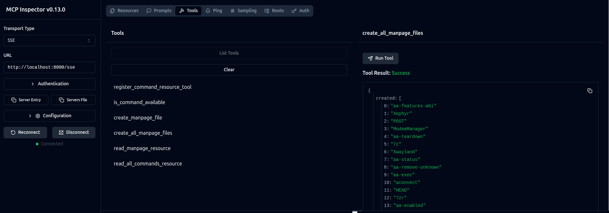
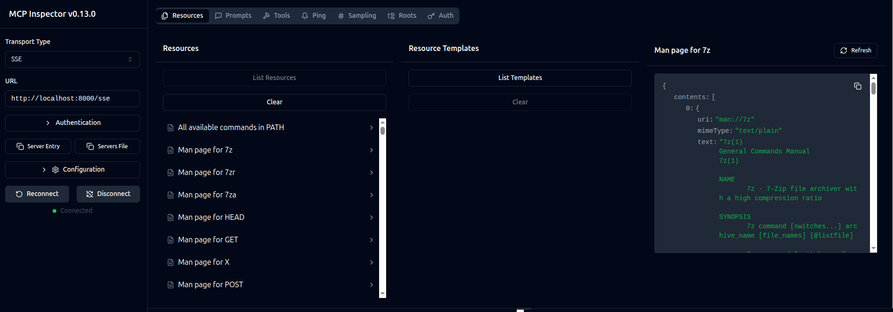

# local-manpage-mcp-server

## Summary
`local-manpage-mcp-server` is an MCP server that extracts and exposes the man pages of all executables in your `$PATH` as MCP resources. Its primary goal is to give an LLM (or any MCP client) direct access to up-to-date documentation for the commands installed on the host system. This server is intended to run on Linux distributions only (see **Disclaimer** below).

The `create_all_manpage_files` tool generates the `manpages/` directory where the extracted man pages are stored. These files are then served when an MCP resource is requested. A wrapper tool is also provided in case your host application does not support MCP resources directly.

## Disclaimer

**Linux Only:** This server is designed exclusively for Linux distributions. It relies on the `man` and `col` utilities (and a standard `$PATH` structure) to extract man pages. It has not been tested on macOS, BSD, or Windows, and may not function correctly on those systems.

**Permissions:** You must have read access to all directories in your `$PATH` and write permissions for a local `manpages/` folder (created automatically).

**Resource Limits:** Generating man pages for a large number of binaries can be CPU- and disk-intensive.

**Argument Safety:** The arguments passed to `man` and `col` are not sanitized or validated. This could potentially allow command injection if malicious input is provided.

## Setup

```bash
git clone https://github.com/yourusername/local-manpage-mcp-server.git
cd local-manpage-mcp-server

python3 -m venv venv
source venv/bin/activate
pip install -r requirements.txt
```

## Starting the MCP Server and Inspector

```bash
uv run mcp dev server.py
```

## Usage

One goal of this project is to provide a self-explanatory server that exposes usage information as a prompt for your host application. This way, your LLM can describe the workflow automatically.

In addition, you must run the `create_all_manpage_files` tool to generate the MCP resources based on the commands available on your system. After execution, all relevant man pages should be accessible as MCP resources.

### With the Inspector

#### Discover prompts for yourself

1. Go to Prompts
2. Click List Prompts
3. e.g. Select guide and click Get Prompt

#### Create the manpage resources

1. Go to Tools
2. Click List Tools
3. Select create_all_manpage_files and click Run Tool

example response:


Now you can
1. Go to Resources
2. Click List Resources
3. Select a man page e.g. `Man page for 7z`
4. Check the response on the right side

example response:
